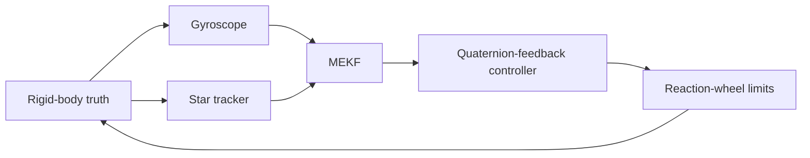

# Robust Spacecraft Attitude Estimation and Control

**A simulation study of MEKF consistency and closed-loop pointing under spacecraft-model and sensor uncertainty.**


> **Status:** The simulation, two MEKF variants, verification tests, and all
> 27 E1-E7 exploratory cases are implemented. The campaign is a pilot
> (10 runs x 100 s per case), not statistically powered mission evidence.
> Longer campaigns, interpretation of stress-case behavior, and a final
> research report remain open. This is not flight-qualified software.

## At a glance

This project asks:

> **When do spacecraft-model and sensor errors make an attitude estimator
> inconsistent, and when does that inconsistency degrade closed-loop pointing?**

It couples a nonlinear rigid-body simulation, gyro and star-tracker models,
two multiplicative extended Kalman filters (MEKFs), quaternion-feedback
control, and a reaction-wheel model. The emphasis is on separating **state
accuracy**, **covariance consistency**, **true pointing performance**, and
**actuator effort**—quantities that should not be conflated.

| | |
|---|---|
| Truth model | Rigid-body rotational dynamics |
| Sensors | 100 Hz gyro; 1 Hz star tracker |
| Estimators | 6-state gyro-driven MEKF; 9-state model-aided MEKF |
| Actuation | Torque- and momentum-limited reaction-wheel model |
| Analysis | NEES/NIS, RMSE, covariance coverage, outage recovery, pointing and control effort |
| Experiments | E0 nominal; E1-E7 model/noise mismatch, outlier, outage, closed-loop, and Monte Carlo |

## Results snapshot

These results are from the checked-in simulation artifacts. E0 is a
single-seed time history; E1-E7 are exploratory ten-run campaigns. Their
confidence intervals describe variation across those runs and do **not**
turn the small pilot into a final statistical study.

| Case | Main observation |
|---|---|
| **E0 nominal, seed 42, 1,000 s** | NEES 6.561; NIS 2.953; true-pointing RMS 0.671 deg; peak 4.243 deg; attitude-estimation RMSE 0.036 deg |
| **E1/E7 matched gyro-driven filter** | Mean NEES 6.007 and NIS 2.973; 95.9% and 97.0% of raw samples, respectively, lie within nominal 95% bounds |
| **E1 model-aided inertia mismatch** | Mean NEES rises from 10.686 when matched to 225,876 at 10% and 1,166,892 at 25% mismatch |
| **E2 process-noise mismatch** | Scaling Q by 0.1 / 1 / 10 gives mean NEES 45.318 / 6.007 / 0.875 |
| **E4 outlier rejection** | With gating, mean NEES is 5.460; without gating, it exceeds 62,000 in the tested cases |
| **E5 star-tracker outages** | Simulated-to-predicted attitude-variance ratios are 1.073, 1.029, and 1.012 for 1-, 10-, and 30-update outages |
| **E6 large-error stress case** | 60 deg initial error and 0.1 rad/s rate produce 1.730 rad (99.1 deg) RMS pointing; commanded torque is saturated about 95.3% of the time |

**Interpretation matters.** E0's first 100 seconds have 2.119 deg pointing
RMS, closely matching E7's 2.120 deg 100-second ensemble mean. E0's full
1,000-second RMS is lower because the initial rate-damping transient is
averaged over a longer interval. E6 is a deliberately severe, actuator-limited
stress case—not nominal pointing or an isolated test of estimator quality.
No mission pointing acceptance requirement has been defined, so these results
are not labeled mission pass/fail.

## Selected figures

### Nominal run: pointing response


### Nominal run: estimator consistency


### Campaign comparisons

Campaign figures are exploratory summaries. Several have large dynamic ranges
and are best interpreted alongside the numeric table rather than in isolation.

| Campaign | Figure | Campaign | Figure |
|---|---|---|---|
| E1: inertia mismatch | [Open plot](reports/research_campaigns/e1_summary.png) | E2: process noise | [Open plot](reports/research_campaigns/e2_summary.png) |
| E3: measurement noise | [Open plot](reports/research_campaigns/e3_summary.png) | E4: outliers | [Open plot](reports/research_campaigns/e4_summary.png) |
| E5: outages | [Open plot](reports/research_campaigns/e5_summary.png) | E6: closed loop | [Open plot](reports/research_campaigns/e6_summary.png) |
| E7: nominal Monte Carlo | [Open plot](reports/research_campaigns/e7_summary.png) | All case metrics | [CSV summary](reports/research_campaigns/summary.csv) · [JSON summary](reports/research_campaigns/summary.json) |

## System and estimator



The truth model propagates attitude and angular rate using

$$I\dot{\boldsymbol{\omega}} +
\boldsymbol{\omega}\times(I\boldsymbol{\omega}) =
\boldsymbol{\tau}_{rw}+\boldsymbol{\tau}_{d}.$$

Sensor models include gyro bias and noise, finite-rate star-tracker updates,
outliers, probabilistic outages, and scheduled one-shot outages. Applied
wheel torque is fed back to the model-aided estimator; performance summaries
distinguish commanded from applied torque and effort.

| Variant | Estimated state | Inertia use | Covariance / NEES |
|---|---|---|---|
| **A: gyro-driven** | Attitude quaternion and gyro bias | Gyro measurement drives kinematic propagation; filter propagation does not use inertia | 6-state error covariance; 6-DOF NEES |
| **B: model-aided** | Attitude quaternion, angular rate, and gyro bias | Euler rigid-body rate propagation uses model inertia and applied wheel torque; gyro updates rate and bias | 9-state error covariance; 9-DOF NEES |

Both variants use multiplicative attitude correction, Joseph-form covariance
updates, and the attitude-error covariance reset Jacobian. Quaternion and
frame conventions are documented in [`docs/conventions.md`](docs/conventions.md).

## Experiment matrix

| ID | Study | Sweep | Question |
|---|---|---|---|
| E0 | Nominal | Matched model and sensor assumptions | What does the nominal implementation produce? |
| E1 | Inertia mismatch | Gyro-driven/model-aided variants; 0%, 10%, 25% | How does inertia error affect consistency and pointing? |
| E2 | Process-noise mismatch | Q scale 0.1, 1, 10 | How sensitive is consistency to process-noise tuning? |
| E3 | Measurement-noise mismatch | R scale 0.1, 1, 10 | How sensitive are innovations and coverage to sensor-noise assumptions? |
| E4 | Outliers | 0.1, 0.5, 1 rad; 5% probability; gate on/off | Does NIS gating limit the effect of anomalous measurements? |
| E5 | Star-tracker outages | 1, 10, 30 update periods | Does covariance growth match the analytical approximation, and how does the filter recover? |
| E6 | Closed-loop stress | Large initial error; estimator/noise and inertia cases | How do estimator and actuator limits affect pointing response? |
| E7 | Monte Carlo | Matched nominal case | Are nominal trends repeatable across seeded runs? |

For Variant A, NEES uses the attitude and gyro-bias error; Variant B also
includes angular-rate error. NIS uses the three-dimensional star-tracker
innovation. Campaign summaries include every available innovation, including
measurements subsequently rejected by the gate; interpret gated NIS with this
definition in mind.

## Verification and evidence

The test suite covers quaternion and dynamics behavior, MEKF dimensions and
updates, the model-aided Euler Jacobian against finite differences, covariance
reset behavior, deterministic outage scheduling, and experiment metrics. The
recorded full run after the estimator changes passed **112 tests**. Selected
analytical checks include the E5 outage covariance-growth comparison.

These checks verify software behavior against the implemented model. They do
not establish hardware fidelity, independent model validation, or flight
readiness. The E1-E7 run is explicitly exploratory: 27 cases, 10 seeded runs
per case, 100 seconds per run.

## Reproduce

### Install and test

```bash
python -m pip install -e ".[dev]"
pytest -q
```

### Run the nominal case and create its report/plots

```bash
python scripts/run_experiment.py --config config/nominal.yaml --output reports/nominal.npz
python scripts/analyze_results.py reports/nominal.npz --all --output-dir reports/nominal_analysis
```

### Run the exploratory E1-E7 campaign

```bash
python scripts/run_research_campaigns.py --campaign all --runs 10 --duration 100 --output-dir reports/research_campaigns
```

The campaign command overwrites files with matching names in its output
directory. To preserve the checked-in pilot, use a new output directory for
reruns. Remove `--duration 100` to use each case's configured duration; longer
campaigns are substantially more computationally expensive.

## Repository layout

```text
config/                  Simulation configurations
docs/                    Conventions and derivations
reports/nominal_analysis/ E0 plots and text report
reports/research_campaigns/ E1-E7 pilot results, summaries, and plots
scripts/                 Simulation, analysis, and campaign entry points
src/actuators/           Reaction-wheel model
src/control/             Attitude controller
src/dynamics/            Quaternion and rigid-body dynamics
src/estimation/          MEKF implementations
src/sensors/             Gyroscope and star tracker
tests/integration/       System-level tests
tests/unit/              Unit and regression tests
```

## Assumptions and remaining work

**Current model boundaries**

- Rigid body only; no flexible modes, fuel slosh, or structural coupling.
- Simplified wheel model; no detailed hardware dynamics, friction, or jitter.
- No orbit propagation or full environmental disturbance model; nominal cases
  use zero disturbance torque.
- One star tracker; no multi-head blending, GNSS, or relative navigation.
- Outlier gating is a measurement-consistency study, not complete FDIR.
- No mission-specific pointing requirement is defined; results are not
  mission acceptance claims.

**Next engineering steps**

1. Investigate model-aided consistency loss under inertia mismatch.
2. Diagnose E6's actuator-saturated recovery behavior and separate controller
   limits from estimator effects.
3. Run longer campaigns with justified run counts, uncertainty sweeps, and
   run-level confidence intervals.
4. Establish consistency boundaries and document independent validation and
   residual model risks.

## References

1. Lefferts, Markley, and Shuster, “Kalman Filtering for Spacecraft Attitude
   Estimation,” *Journal of Guidance, Control, and Dynamics*, 1982.
2. Markley and Crassidis, *Fundamentals of Spacecraft Attitude Determination
   and Control*, Springer, 2014.
3. Trawny and Roumeliotis, “Indirect Kalman Filter for 3D Attitude
   Estimation,” University of Minnesota, 2005.
4. Solà, “Quaternion Kinematics for the Error-State Kalman Filter,” 2017.
5. Bar-Shalom, Li, and Kirubarajan, *Estimation with Applications to Tracking
   and Navigation*, Wiley, 2001.

---

**Kowluri Ishmael** · Spacecraft GNC · Attitude Estimation · Flight Dynamics · Control
