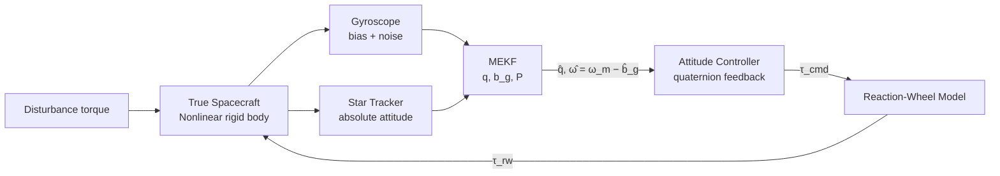
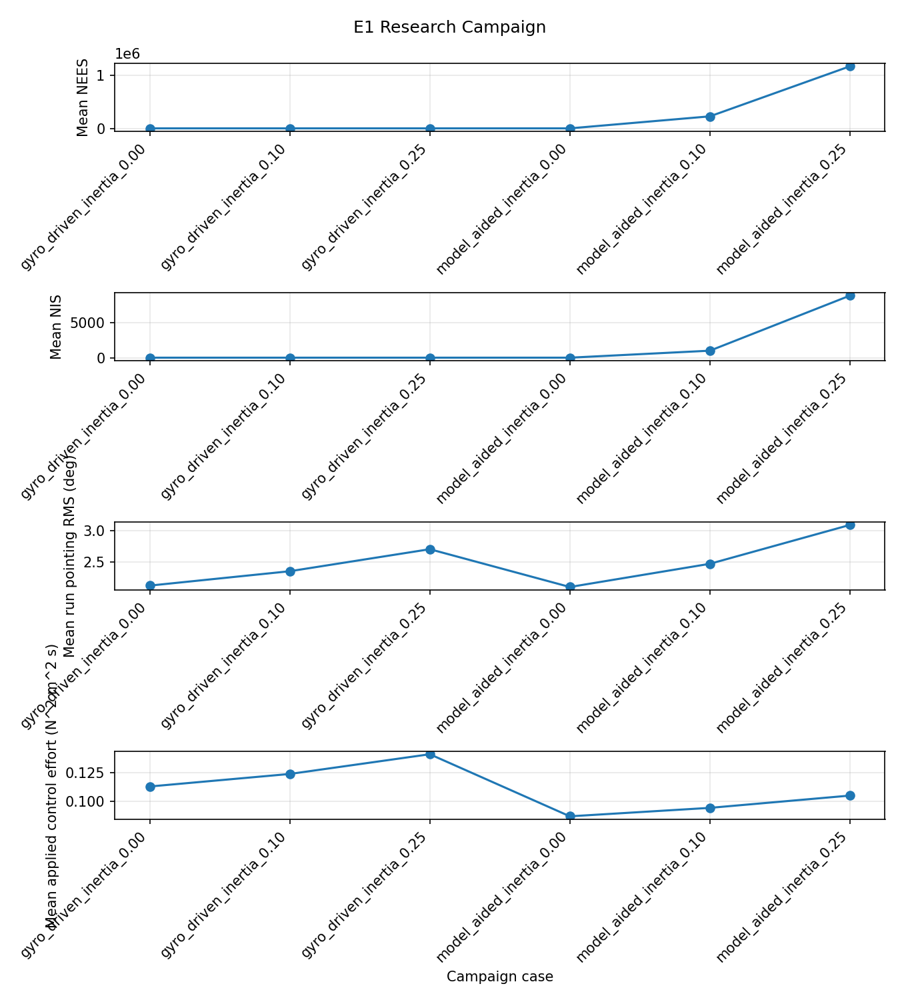
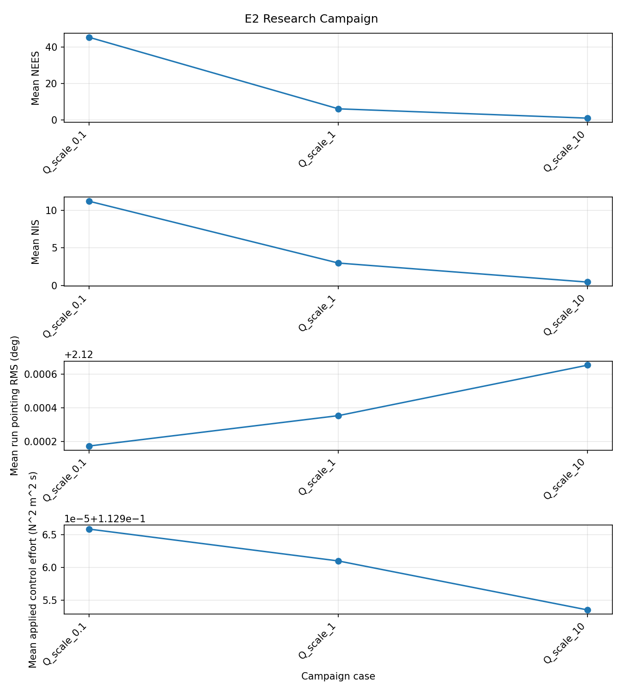
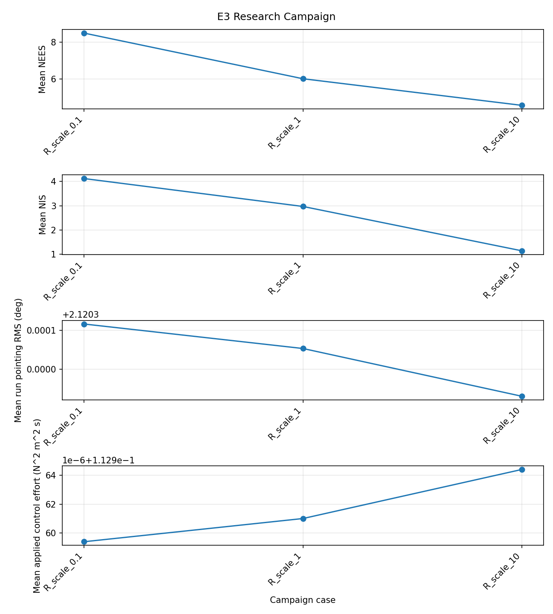
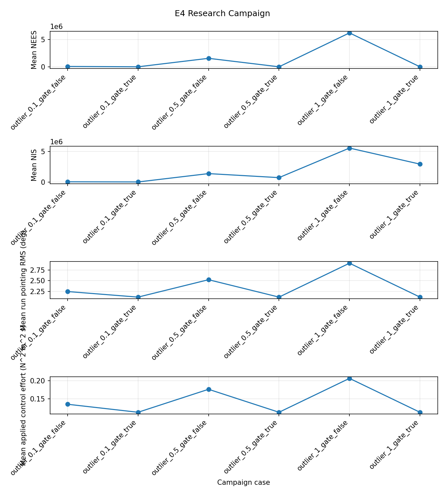
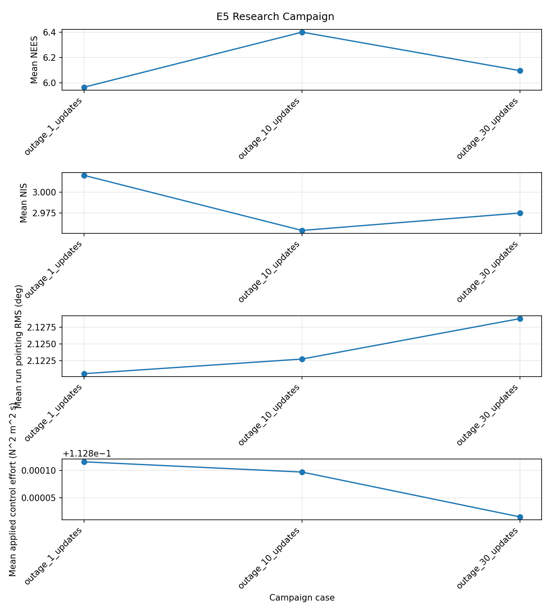
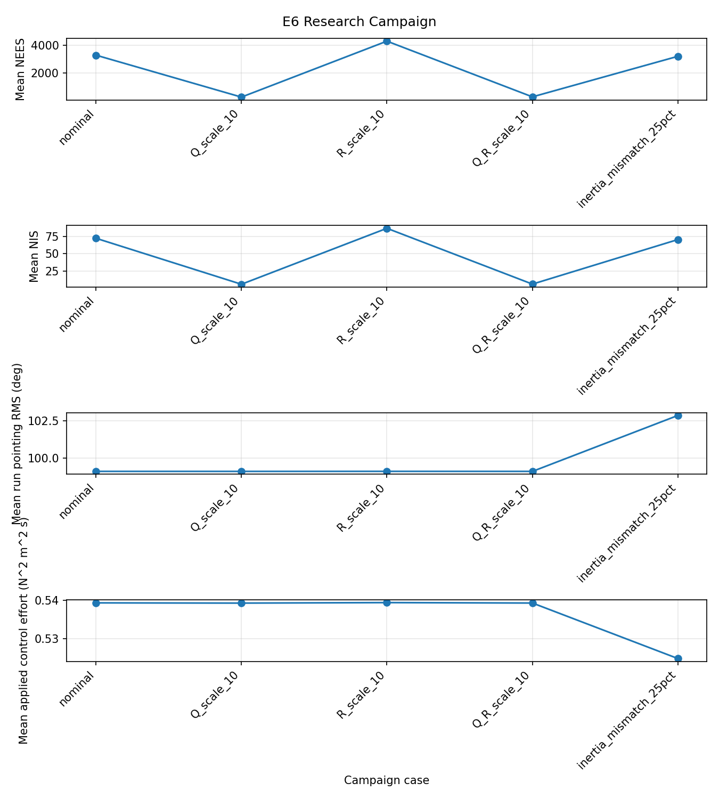
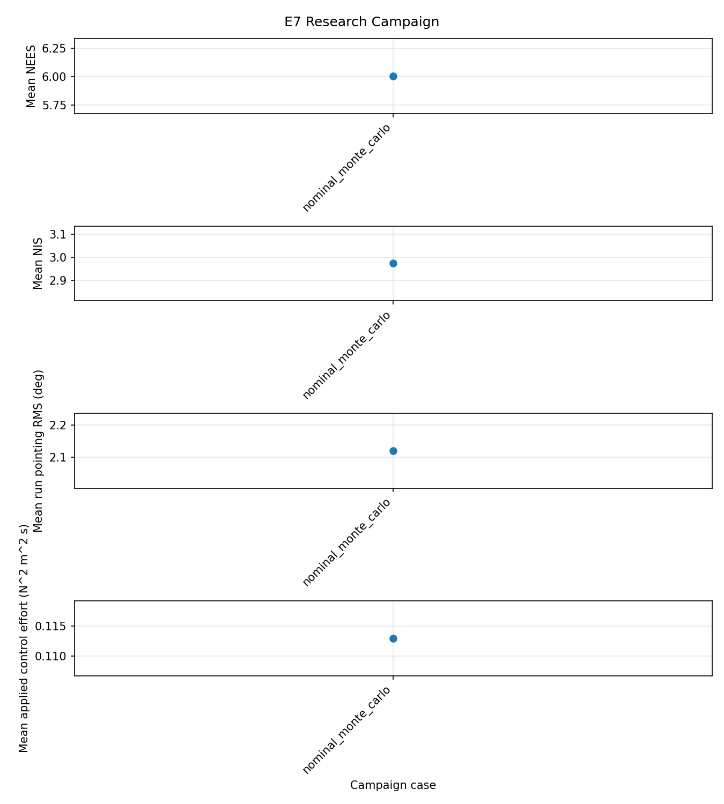

# Spacecraft Attitude Estimation Robustness Under Model Uncertainty

**MEKF statistical consistency and its coupling to closed-loop pointing performance, under spacecraft-model and sensor mismatch.**

  

------------------------------------------------------------------------

## Research Question

> **How wrong can the spacecraft model and sensor assumptions be before the attitude estimator becomes statistically inconsistent, and how much closed-loop pointing performance is lost as a consequence?**

The deliverable is not a statement that "the MEKF works." It is a quantified engineering boundary:

$$\text{Model / Sensor Uncertainty} \;\rightarrow\; \text{Consistency Limit} \;\rightarrow\; \text{Pointing-Performance Limit}$$

supported by NEES/NIS statistics, Monte Carlo distributions, covariance behaviour, and closed-loop metrics.

> **Project status:** the estimator, controller, verification tests, and all 27
> exploratory E1-E7 cases are implemented and run. The results below are
> preliminary (10 Monte Carlo runs per case, 100 s for the uniform pilot).
> Final statistically powered campaigns and some interpretation remain open;
> this repository does not claim flight qualification or mission acceptance.

### Contents

- [Why this problem](#why-this-problem)
- [Scope and architecture](#scope)
- [Models and estimator](#models)
- [Consistency and experiment matrix](#consistency-evaluation)
- [Verification](#verification--validation)
- [Results and status](#results)
- [Repository layout](#repository-structure)
- [Getting started](#getting-started)
- [Assumptions, limitations, and remaining work](#assumptions--limitations)

------------------------------------------------------------------------

## Why This Problem

A filter can have a small RMSE and still be unfit for flight. Downstream consumers (the controller, fault detection, mode-transition logic) act on the **reported covariance** as much as on the state estimate. An optimistic covariance leads to over-trusted estimates, wrongly accepted outliers and mis-sized margins. A pessimistic one wastes performance. This project separates two properties that are often conflated:

| Property | Question | Metric |
|------------------------|------------------------|------------------------|
| **Accuracy** | Is the estimate close to truth? | RMSE, bias, convergence time |
| **Consistency** | Does the covariance describe the actual error? | NEES, NIS, $3\sigma$ containment |

and then asks when degraded accuracy or consistency actually becomes **control-limiting**.

------------------------------------------------------------------------

## Scope

**In scope:** nonlinear rigid-body truth model, gyro + star-tracker sensing, MEKF (attitude + gyro bias), quaternion-feedback control, reaction-wheel torque actuation, controlled model/noise mismatch, star-tracker outage and outlier, Monte Carlo analysis.

**Out of scope (deliberately):** orbital and relative navigation, rendezvous/docking, GNSS, camera/LiDAR navigation, UKF/particle filters, MPC, reinforcement learning, full FDIR, detailed wheel hardware characterisation, full orbital-environment modelling. These are valid topics. They are excluded because they would dilute a single, deep investigation.

------------------------------------------------------------------------

## System Architecture



The architecture is intentionally minimal so that estimator behaviour can be isolated and attributed.

------------------------------------------------------------------------

## Models

### Conventions

All conventions are frozen before implementation and documented in `docs/conventions.md`:

- Quaternion: scalar-last, JPL-style multiplicative error $q_{true} = \delta q \otimes \hat{q}$ (body-frame error), consistent with the error-state notation below
- Frames: inertial $\mathcal{I}$, body $\mathcal{B}$; $q$ maps $\mathcal{I} \rightarrow \mathcal{B}$
- Error definitions: $e_b = b_{g,true} - \hat{b}_g$; attitude error $\delta\theta$ from $\delta q \approx [\tfrac{1}{2}\delta\boldsymbol{\theta},\, 1]^T$
- Units: SI; angles in rad internally, reported in arcsec / deg

### Truth dynamics

$$I\dot{\boldsymbol{\omega}} + \boldsymbol{\omega}\times(I\boldsymbol{\omega}) = \boldsymbol{\tau}_{rw} + \boldsymbol{\tau}_d, \qquad \dot{q} = \tfrac{1}{2}\Omega(\boldsymbol{\omega})\,q$$

The truth model and the estimator/controller model are **intentionally allowed to differ**, e.g. $I_{model} = I_{true} + \Delta I$.

### Gyroscope

$$\boldsymbol{\omega}_m = \boldsymbol{\omega} + \mathbf{b}_g + \mathbf{n}_g, \qquad \dot{\mathbf{b}}_g = \mathbf{n}_b$$

with angle random walk ($\sigma_v$) and bias random walk ($\sigma_u$) parameters.

### Star tracker

Absolute attitude measurement $q_{ST} = \delta q_{ST} \otimes q$, with $\delta q_{ST} \approx [\tfrac{1}{2}\delta\boldsymbol{\theta}_{ST},\,1]^T$. Supports finite update rate, measurement noise, probabilistic outliers, probabilistic outages, and deterministic one-shot outage schedules.

### Actuator

Reaction-wheel torque is modelled as $\boldsymbol{\tau}_{rw} \approx -\dot{\mathbf{h}}_{rw}$ with torque and momentum limits. The model is kept simple on purpose to keep attention on estimator-to-control coupling.

------------------------------------------------------------------------

## Estimator: Multiplicative Extended Kalman Filter

| Item | Definition |
|------------------------------------|------------------------------------|
| Nominal state | Variant A: $[\hat{q},\, \hat{\mathbf{b}}_g]$; Variant B: $[\hat{q},\,\hat{\boldsymbol{\omega}},\,\hat{\mathbf{b}}_g]$ |
| Error state | Variant A: $[\delta\boldsymbol{\theta},\, \delta\mathbf{b}_g]^T \in \mathbb{R}^6$; Variant B: $[\delta\boldsymbol{\theta},\,\delta\boldsymbol{\omega},\,\delta\mathbf{b}_g]^T \in \mathbb{R}^9$ |
| Error dynamics | $\delta\dot{x} = F\delta x + Gw$ |
| Covariance propagation | $\dot{P} = FP + PF^T + GQG^T$, discretised from the continuous model (van Loan) |
| Measurement | $z_k = H_k\delta x_k + v_k$, innovation $\nu_k = z_k - h(\hat{x}_k^-)$ |
| Innovation covariance | $S_k = H_kP_k^-H_k^T + R_k$ |
| Gain | $K_k = P_k^-H_k^TS_k^{-1}$ |
| Covariance update | Joseph form $P_k^+ = (I-K_kH_k)P_k^-(I-K_kH_k)^T + K_kR_kK_k^T$ |
| Correction | Multiplicative quaternion injection, then **error-state reset** (including the reset Jacobian on $P$) |

### Estimator variants

The role of the inertia matrix depends on how the filter is propagated, so the study makes this explicit:

- **Variant A (gyro-driven, baseline):** the measured rate drives kinematic propagation. The filter does not depend on $I$; inertia error then acts through the controller and feedforward terms only.
- **Variant B (model-aided):** the nine-dimensional error state is $[\delta\boldsymbol{\theta},\delta\boldsymbol{\omega},\delta\mathbf{b}_g]$. Rate is initialized from the gyro, propagated with Euler's equations using $I_{model}$ and applied wheel torque, then corrected by gyro measurements; star-tracker updates correct attitude and correlated states. Inertia mismatch enters the estimator directly through process-model error, and NEES uses nine degrees of freedom.

Comparing A and B isolates *where* inertia uncertainty hurts: the estimator, the controller, or both.

------------------------------------------------------------------------

## Consistency Evaluation

For Variant A, the six-dimensional estimation error is $e = [\delta\boldsymbol{\theta},\; \mathbf{b}_{g,true}-\hat{\mathbf{b}}_g]^T$. Variant B additionally includes angular-rate error, giving nine dimensions:

$$\epsilon_{NEES} = e^TP^{-1}e, \qquad \epsilon_{NIS} = \nu^TS^{-1}\nu$$

Over $N$ independent Monte Carlo runs, the time-indexed average satisfies $N\bar{\epsilon}_{NEES} \sim \chi^2_{N n_x}$, where $n_x=6$ for Variant A and $n_x=9$ for Variant B. NIS uses $n_z = 3$ for the star-tracker attitude measurement; its bounds at each update epoch use the actual number of available measurements across runs. NIS summaries include every available innovation, including measurements later rejected by the gate, so rejected outliers remain visible in the diagnostic. NEES and NIS reporting confidence levels are configured independently.

Additional measures: attitude and bias RMSE, covariance growth, $3\sigma$ containment, convergence time, innovation whiteness (autocorrelation test).

Interpretation:

| Observation | Typical meaning |
|------------------------------------|------------------------------------|
| NEES above upper bound | Optimistic covariance (under-modelled noise, unmodelled dynamics) |
| NEES below lower bound | Conservative covariance (over-tuned $Q$ or $R$) |
| NIS and NEES disagree | Error is hidden from the measurement path: suspect process model or unobservable directions |

------------------------------------------------------------------------

## Experiment Matrix

| ID | Experiment | Independent variable | Primary question | Key outputs |
|---------------|---------------|---------------|---------------|---------------|
| E0 | Nominal | None | Is the implementation correct and consistent? | NEES/NIS inside bounds |
| E1 | Inertia mismatch | $\Delta I$ (magnitude and structure) | How sensitive is consistency to model error? | NEES vs. $\lVert\Delta I\rVert/\lVert I\rVert$, A vs. B |
| E2 | Process-noise mismatch | $Q_{model}/Q_{true}$ | Sensitivity to optimistic/conservative $Q$ | NEES, convergence time |
| E3 | Measurement-noise mismatch | $R_{model}/R_{true}$ | Sensitivity to star-tracker quality assumptions | NIS, $3\sigma$ containment |
| E4 | Outlier | Injected innovation magnitude | Can inconsistent measurements be detected? | Accept vs. reject: state, $P$, pointing |
| E5 | Outage | Outage duration | How fast does uncertainty grow, and what is the recovery cost? | $P(t)$, error, recovery transient |
| E6 | Closed loop | Estimator degradation level | When does estimation become control-limiting? | Pointing error, settling time, effort |
| E7 | Monte Carlo | Initial conditions and parameters | Are conclusions statistically repeatable? | Distributions, confidence intervals |

The experiment configurations define common physical and sensor assumptions. The parameter grids and case labels are defined in `scripts/run_research_campaigns.py`; each Monte Carlo run uses a deterministic seed offset from the case's configured seed. Per-case time histories, a CSV/JSON metric table, and campaign plots are written to the selected output directory.

------------------------------------------------------------------------

## Closed-Loop Study

The controller consumes the estimator output with bias-corrected rate $\hat{\boldsymbol{\omega}} = \boldsymbol{\omega}_m - \hat{\mathbf{b}}_g$ and the quaternion feedback law

$$\boldsymbol{\tau}_c = -K_q\,\boldsymbol{q}_{e,v} - K_\omega\,\hat{\boldsymbol{\omega}}$$

Three feedback configurations separate controller limits from estimator limits:

| Configuration | Feedback state | Purpose |
|------------------------|------------------------|------------------------|
| Truth-state | $q_{true},\,\boldsymbol{\omega}_{true}$ | Ideal controller reference |
| Estimated-state | $\hat{q},\,\hat{\boldsymbol{\omega}}$ | Flight-like baseline |
| Degraded estimate | MEKF under injected mismatch | Quantify estimation-induced loss |

Spacecraft pointing error is measured from the **true attitude** to the desired attitude; attitude-estimation error is reported separately. Metrics include pointing RMS/peak, 2%-of-initial-error settling time, commanded and applied peak torque, commanded and applied control effort ($\int\lVert\tau\rVert^2dt$), estimation error, 3-sigma component coverage, and outage recovery where applicable. No mission pointing limit has been specified, so results compare the metrics across cases but do not declare an acceptable/failed flight-performance boundary.

------------------------------------------------------------------------

## Sensor Degradation Cases

### Star-tracker outage

With no absolute updates, attitude uncertainty is driven by gyro noise and bias. As an analytical cross-check on the simulated covariance, the attitude variance per axis during a long outage should follow approximately

$$\sigma_\theta^2(t) \approx \sigma_{\theta,0}^2 + \sigma_v^2\,t + \sigma_{b,0}^2\,t^2 + \tfrac{1}{3}\sigma_u^2\,t^3$$

Here $\sigma_{\theta,0}^2$ and $\sigma_{b,0}^2$ are the filter's posterior
attitude and bias variances at outage onset, rather than the sensor's initial
bias parameter.

The campaign injects a deterministic one-shot outage at a configured simulation time and maps $\text{outage duration} \rightarrow \text{covariance growth} \rightarrow \text{pointing degradation} \rightarrow \text{recovery transient}$. The implementation also retains probabilistic outages for stochastic sensor-degradation studies.

### Star-tracker outliers

Outliers are injected probabilistically for the E4 gated/ungated sweep and evaluated using the NIS statistic against a configurable $\chi^2_3$ threshold. Gating is disabled in the nominal configuration; its confidence is configured separately from the NIS reporting confidence. The comparison covers state, covariance, and closed-loop pointing. This is a **measurement-consistency study, not a full FDIR design.**

------------------------------------------------------------------------

## Verification & Validation

Verification proceeds bottom-up so that software defects are separated from genuine GNC behaviour:

``` text
Quaternion algebra → Rigid-body dynamics → Sensor models → MEKF propagation
→ MEKF update → Consistency metrics → Controller → Closed loop → Monte Carlo
```

The implemented verification coverage includes:

- Quaternion and rigid-body dynamics unit checks
- Analytic model-aided rate Jacobian against finite differences
- MEKF state dimension, gyro initialization/update, and covariance-reset regressions
- Matched-model nominal consistency diagnostics
- Deterministic star-tracker outage behavior and an analytical covariance-growth cross-check
- Commanded-versus-applied torque and performance-metric regressions

The recorded full test run after the estimator changes passed **112 tests**.
Unit tests live in `tests/unit/`; system-level tests live in `tests/integration/`.
This is software verification of the implemented model, not independent
hardware validation or flight qualification. Optional independent
cross-validation in MATLAB/Simulink remains future work.

------------------------------------------------------------------------

## Results

### E0 nominal run (single seed)

The first reproducible 1000 s nominal run (`config/nominal.yaml`, seed 42) completed
with 100,000 time steps. The run produced a mean NEES of 6.561 and mean NIS of 2.953;
96.7% of NEES samples and 95.1% of valid NIS samples fell within their raw 95%
chi-squared bounds (6 and 3 degrees of freedom, respectively). True spacecraft
pointing-error RMS was 0.671 deg and peak error was 4.243 deg; the separate
attitude-estimation RMSE was 0.036 deg. The 0.036 deg figure is estimator accuracy,
not closed-loop pointing performance.

These are **single-run, time-series diagnostics**, not Monte Carlo confidence
claims; adjacent samples are correlated. The first 100 s of this same saved run
have 2.119 deg pointing RMS, which is consistent with the E7 100 s ensemble
mean below. The lower full-run RMS reflects the longer averaging window as the
initial rate transient damps; E0 and E7 should only be compared at matching
durations. Results and plots are in
[`reports/nominal_analysis/`](reports/nominal_analysis/), with the raw simulation
history in [`reports/nominal.npz`](reports/nominal.npz).

### E1-E7 exploratory campaign

All **27 cases** completed with 10 deterministic-seed runs per case and a
uniform 100 s duration. This is a trend-finding pilot, not the planned final
study of 50-100 runs at longer durations. The CSV/JSON summaries, compressed
case histories, and campaign plots are in
[`reports/research_campaigns/`](reports/research_campaigns/).

| Artifact | Purpose |
|---|---|
| [`summary.csv`](reports/research_campaigns/summary.csv) · [`summary.json`](reports/research_campaigns/summary.json) | Per-case metrics and run-level confidence intervals |
| [`nominal_report.txt`](reports/nominal_analysis/nominal_report.txt) | E0 consistency, pointing, estimator, and actuator summary |
| [`run_research_campaigns.py`](scripts/run_research_campaigns.py) | Campaign definitions, deterministic seeds, and output generation |

| Campaign | What was varied | Representative pilot finding |
|---|---|---|
| E1: inertia mismatch | Inertia error; gyro-driven vs. model-aided MEKF | Gyro-driven NEES stayed near 6 through 25% mismatch; model-aided NEES rose from 10.686 matched to $2.26\times10^5$ at 10% and $1.17\times10^6$ at 25% |
| E2: process noise | $Q$ scale: 0.1, 1, 10 | Mean NEES was 45.318, 6.007, and 0.875, respectively |
| E3: measurement noise | $R$ scale: 0.1, 1, 10 | Mean NIS was 4.123, 2.973, and 1.147, respectively |
| E4: outlier/gating | 0.1, 0.5, 1 rad outlier magnitudes at 5% probability; gating on/off | Gating limited mean NEES to 5.460; ungated mean NEES exceeded $6.2\times10^4$. NIS includes rejected innovations and therefore remains a diagnostic of the anomalous measurements |
| E5: tracker outage | 1, 10, 30 consecutive 1 Hz updates | Observed/predicted attitude-variance ratios were 1.073, 1.029, and 1.012 |
| E6: closed-loop stress | 60 deg initial attitude error, 0.1 rad/s initial rate; estimator variants | Baseline stress-case pointing RMS was 1.730 rad (99.1 deg); commanded torque was at its limit for 95.3% of samples |
| E7: nominal repeatability | Matched nominal configuration | Mean NEES 6.007, NIS 2.973; 95.9%/97.0% of raw samples fell inside nominal 95% bounds |

**How to read the E0/E7 pointing results:** E0 is one 1,000 s run (0.671 deg
RMS); E7 is a 10-run ensemble at 100 s per run (2.120 deg mean RMS). A
duration-matched slice of the E0 history gives 2.119 deg RMS over its first
100 s. The difference is explained by the early rate-damping transient being
included in the shorter window—not by a contradictory filter result.

**How to read E6:** this is an intentionally severe, large-initial-error
closed-loop stress test, not nominal pointing and not an isolated measure of
estimator quality. The sustained torque saturation and near-180 deg peak
pointing error show that this configuration does not recover effectively
within the 100 s pilot. No mission pointing acceptance threshold has been
specified, so no mission-level pass/fail claim is made.

| Deliverable | Status |
|---|---|
| Estimator variants, metrics, and E1-E7 pilot tooling | Complete |
| Corrected 27-case exploratory campaign and per-case artifacts | Complete |
| Nominal seed-42 simulation and analysis artifacts | Complete |
| E5 analytical outage-growth cross-check | Complete for tested outage durations |
| Longer, statistically powered campaigns and consistency limits | Pending |
| Mission pointing acceptance threshold / mission-level claim | Not defined; outside current evidence |

### Campaign plots

The following figures summarize the completed exploratory sweeps. They visualize
pilot trends; use `summary.csv` and `summary.json` for the recorded metrics.

| E1: inertia | E2: process noise | E3: measurement noise |
|---|---|---|
|  |  |  |

| E4: outliers | E5: outages | E6: closed-loop |
|---|---|---|
|  |  |  |

| E7: nominal repeatability | E0: nominal diagnostics |
|---|---|
|  |  |

------------------------------------------------------------------------

## Repository Structure

``` text
spacecraft-estimation-control/
├── config/                  # YAML simulation and campaign configurations
├── docs/                    # Frame and quaternion conventions
├── reports/
│   ├── nominal_analysis/    # E0 diagnostic plots and text report
│   ├── research_campaigns/  # E1-E7 pilot CSV/JSON, plots, and NPZ cases
│   └── nominal.npz          # E0 seed-42 history
├── scripts/
│   ├── analyze_results.py
│   ├── run_experiment.py
│   └── run_research_campaigns.py
├── src/
│   ├── actuators/           # Reaction-wheel model
│   ├── control/             # Attitude controller
│   ├── dynamics/            # Quaternion and rigid-body dynamics
│   ├── estimation/          # MEKF variants
│   └── sensors/             # Gyroscope and star tracker
├── tests/
│   ├── integration/
│   └── unit/
├── pyproject.toml
├── requirements.txt
└── README.md
```

## Technology

Python · NumPy · SciPy · Matplotlib · pytest · Git/GitHub. MATLAB/Simulink for optional cross-validation.

## Getting Started

Install the package and development dependencies, then run the test suite:

``` bash
python -m pip install -e ".[dev]"
pytest -q
```

Run a configured simulation and save its results:

``` bash
python scripts/run_experiment.py --config config/nominal.yaml --output reports/nominal.npz
```

Run the configured Monte Carlo campaign with a smaller run count for a quick check:

``` bash
python scripts/run_experiment.py --config config/nominal.yaml --monte-carlo --runs 5 --output reports/nominal_mc.npz
```

Generate the text report and diagnostic plots:

``` bash
python scripts/analyze_results.py reports/nominal.npz --all --output-dir reports/nominal_analysis
```

Run the E1-E7 parameter grids. Omit `--duration` to use each experiment's configured
duration; use a shorter duration for a smoke test, not for final conclusions:

``` bash
python scripts/run_research_campaigns.py --campaign all --runs 10 --duration 100 --output-dir reports/research_campaigns
```

The runner emits one compressed time-history file per case plus `summary.csv`,
`summary.json`, and one comparison plot per campaign. For a longer campaign,
omit `--duration` to use the configured duration for each experiment. The
campaigns can be run individually with `--campaign E1`, `--campaign E2`, etc.
The current pilot artifacts should be preserved separately when starting a
new run (choose a new `--output-dir`).

------------------------------------------------------------------------

## Assumptions & Limitations

- Rigid-body spacecraft: no flexible modes, slosh, or structural coupling
- Simplified reaction-wheel assembly: no friction, jitter, detailed wheel geometry,
  or hardware faults beyond modeled torque/momentum limits
- No orbit propagation or full environmental disturbance model; nominal
  configurations use zero disturbance torque
- Single star tracker; no multiple-head blending, horizon sensors, GNSS, or
  relative-navigation sensors
- Outlier gating is a measurement-consistency demonstration, not a complete
  fault-detection, isolation, and recovery (FDIR) design
- No mission pointing requirement is defined; results are reported without
  claiming mission acceptance or flight readiness
- Conclusions are limited to the implemented model and tested parameter ranges

## Roadmap

- [x] Define and document quaternion/frame conventions
- [x] Implement rigid-body truth dynamics, gyro/star-tracker models, controller,
  and reaction-wheel actuator
- [x] Implement gyro-driven 6-state and model-aided 9-state MEKF variants
- [x] Add estimator, covariance-reset, Jacobian, sensor-outage, and
  experiment-metric regression tests
- [x] Separate true pointing from attitude-estimation error; report commanded
  and applied torque/effort
- [x] Generate E0 nominal outputs and complete the 27-case, 10-run x 100 s E1-E7 pilot
- [x] Compare E5 outage covariance growth with the analytical approximation
- [ ] Investigate model-aided consistency loss under inertia mismatch and the
  actuator-saturated E6 recovery behavior
- [ ] Run longer, statistically stronger campaigns and establish consistency
  boundaries for the tested uncertainty ranges
- [ ] Prepare a final results report and document remaining model validation work

The absence of a mission pointing threshold is intentional in this study
phase: the current model has no mission-level pointing requirement from which
to derive a defensible pass/fail limit.

## References

1.  Lefferts, Markley, Shuster, "Kalman Filtering for Spacecraft Attitude Estimation," *J. Guidance, Control, and Dynamics*, 1982.
2.  Markley, Crassidis, *Fundamentals of Spacecraft Attitude Determination and Control*, Springer, 2014.
3.  Trawny, Roumeliotis, "Indirect Kalman Filter for 3D Attitude Estimation," UMN Tech. Report, 2005.
4.  Solà, "Quaternion Kinematics for the Error-State Kalman Filter," 2017.
5.  Bar-Shalom, Li, Kirubarajan, *Estimation with Applications to Tracking and Navigation*, Wiley, 2001 (NEES/NIS).

------------------------------------------------------------------------

## Author

**Kowluri Ishmael** · Spacecraft GNC · Attitude Estimation · Flight Dynamics · Control