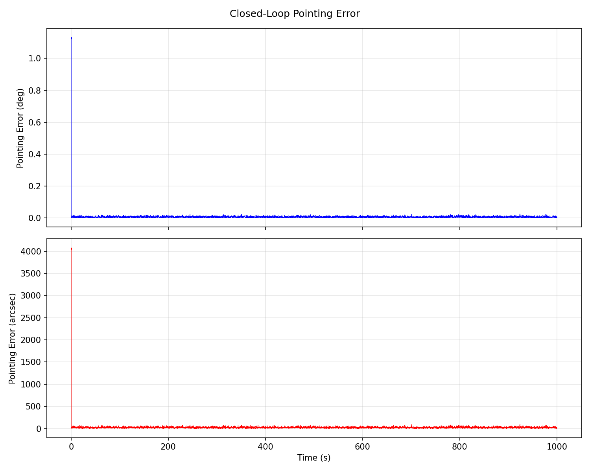
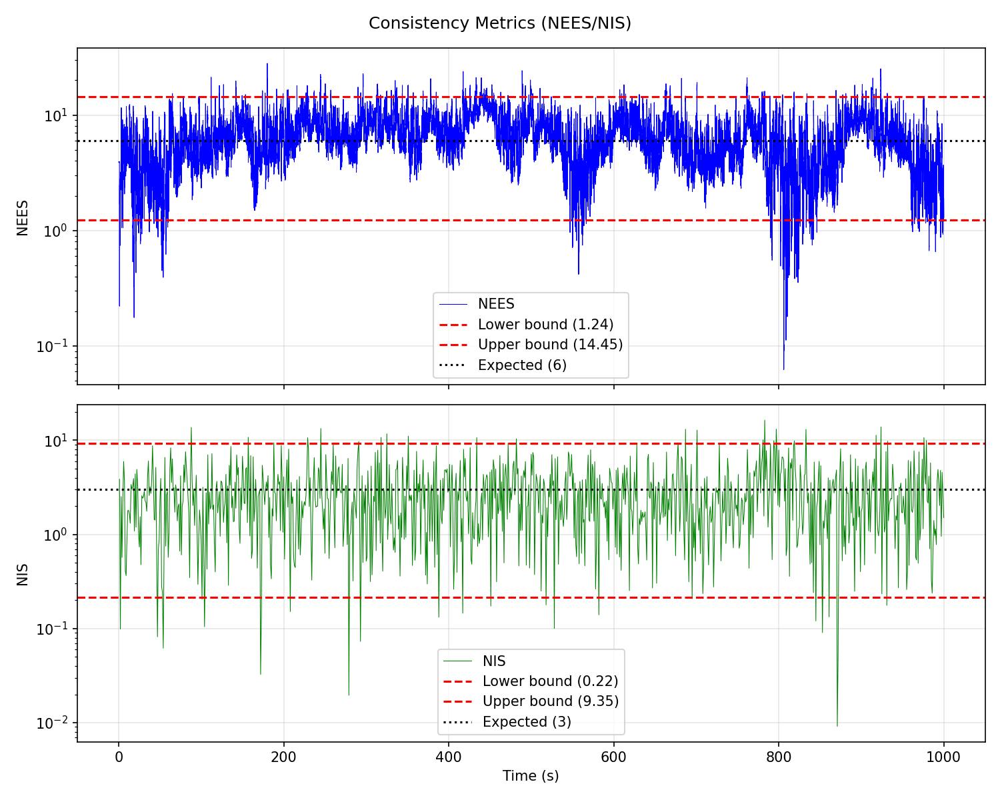
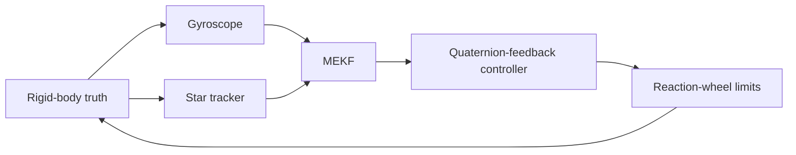

# Robust Spacecraft Attitude Estimation and Control

**A simulation study of MEKF consistency and closed-loop pointing under spacecraft-model and sensor uncertainty.**


> **Status:** The simulation, two MEKF variants, verification tests, and the E0-E7
> campaign infrastructure are implemented. Numerical campaign results must be
> regenerated after the reaction-wheel sign correction before they are treated
> as current evidence. The study is exploratory and not flight-qualified software.

## At a glance

This project asks:

> **When do spacecraft-model and sensor errors make an attitude estimator
> inconsistent, and when does that inconsistency degrade closed-loop pointing?**

It couples a nonlinear rigid-body simulation, gyro and star-tracker models,
two multiplicative extended Kalman filters (MEKFs), quaternion-feedback
control, and a reaction-wheel model. The emphasis is on separating **state
accuracy**, **covariance consistency**, **true pointing performance**, and
**actuator effort**—quantities that should not be conflated.

| | |
|---|---|
| Truth model | Rigid-body rotational dynamics |
| Sensors | 100 Hz gyro; 1 Hz star tracker |
| Estimators | 6-state gyro-driven MEKF; 9-state model-aided MEKF |
| Actuation | Torque- and momentum-limited reaction-wheel model |
| Analysis | NEES/NIS, RMSE, covariance coverage, outage recovery, pointing and control effort |
| Experiments | E0 nominal; E1-E7 model/noise mismatch, outlier, outage, closed-loop, and Monte Carlo |

## Performance assessment

The repository contains pilot campaign artifacts for reference, but those numerical
values were generated before the reaction-wheel sign correction. **They are not
current engineering evidence and should not be used for conclusions.** Regenerate
E0-E7 with the current implementation before quoting quantitative results. The
intended campaign is 10 runs × 100 s per case unless a configuration specifies
otherwise. Any 95% intervals should be interpreted as descriptive run-level
intervals, not qualification evidence.

### Estimator accuracy and consistency

| Metric | E0 nominal (1 run, 1,000 s) | E7 matched nominal (10 runs, 100 s) | Engineering interpretation |
|---|---:|---:|---|
| Attitude-estimation RMSE | 0.0363 deg | 0.0944 deg; 95% CI [0.0749, 0.1139] deg | Different evaluation windows; E7 includes more of the initial rate transient |
| Angular-rate RMSE | 0.0573 deg/s | 0.0574 deg/s | Similar rate error in these matched nominal setups |
| Gyro-bias RMSE | 0.000801 deg/s | 0.00178 deg/s | The short pilot gives a less settled bias estimate |
| Mean NEES (6 DOF) | 6.561 (expected 6) | 6.007 (expected 6) | Means are near the theoretical expectation |
| Mean NIS (3 DOF) | 2.953 (expected 3) | 2.973 (expected 3) | Means are near the theoretical expectation |
| Attitude / bias component $3\sigma$ coverage | 99.74% / 99.73% | 99.76% / 99.77% | Coverage is high in the matched nominal cases |
| Consistency-bound statistic | NEES: 96.7%; NIS: 95.1% of valid updates | NEES: 95.9%; NIS: 97.0% of update epochs | E0 checks individual samples; E7 checks time epochs of the ensemble-mean statistics against run-count-adjusted bounds |

The E7 confidence interval for pointing RMS is **2.115-2.126 deg** across
the ten run-level values; the corresponding attitude-estimation RMSE interval
is listed above. The displayed NEES/NIS in-bound percentages are descriptive
fractions over time. Adjacent epochs are correlated, so these percentages are
not independent-trial confidence statements and are not, by themselves, a
formal pass/fail test.

### Pointing and actuator performance

| Metric | E0 nominal, 1,000 s | E7 nominal pilot, 100 s | E6 large-error stress, 100 s |
|---|---:|---:|---:|
| True-pointing RMS | 0.671 deg | 2.120 deg; 95% CI [2.115, 2.126] deg | 99.123 deg |
| Mean run peak pointing error | 4.243 deg | 4.257 deg | 179.994 deg |
| Final pointing error | 0.0167 deg | 0.129 deg | 120.122 deg |
| 2%-of-initial-error settling | Not defined (initial error is zero) | Not defined (initial error is zero) | Not achieved within 100 s |
| Peak commanded / applied torque | 0.100 / 0.100 N m | 0.100 / 0.100 N m | 0.100 / 0.100 N m |
| Command torque at limit | 0.30% of samples | 2.80% of samples | 95.33% of samples |
| Commanded / applied torque-squared effort | 0.3947 / 0.3573 N^2 m^2 s | 0.1239 / 0.1130 N^2 m^2 s | 0.9717 / 0.5394 N^2 m^2 s |
| Applied / commanded effort | 90.5% | 91.1% | 55.5% |
| Wheel momentum utilization | Not reported | Not reported | Not reported |

E0 and E7 are consistent when compared over equal durations: E0's first 100 s
have **2.119 deg** pointing RMS, versus E7's **2.120 deg** mean. The 1,000 s
E0 RMS is smaller because the initial rate-damping transient is diluted over
the longer record. E6's 95% saturation and 120 deg final error indicate that
the tested controller/actuator configuration does not recover from this
large-error initial condition in the 100 s window. Since E6's Q/R variants
also remain near 99.1 deg RMS with similar saturation, actuator-limited
behavior dominates these particular results; this does not establish that
estimator quality is irrelevant outside this regime.

### Model and sensor degradation

| Test case | Estimator RMSE | Mean NEES / NIS | Attitude $3\sigma$ coverage | Pointing RMS | Engineering finding |
|---|---:|---:|---:|---:|---|
| Gyro-driven, 25% inertia mismatch | 0.0944 deg | 6.012 / 2.974 | 99.76% | 2.702 deg | Filter consistency remains near nominal, but pointing worsens from the matched 2.120 deg pilot |
| Model-aided, matched inertia | 0.0940 deg | 10.686 / 3.033 | 98.75% | 2.098 deg | Attitude accuracy is similar; NEES is elevated relative to the 9-DOF expectation |
| Model-aided, 10% inertia mismatch | 0.1301 deg | $2.26\times10^5$ / 1,009 | 11.19% | 2.469 deg | Severe inconsistency and covariance under-coverage |
| Model-aided, 25% inertia mismatch | 0.2802 deg | $1.17\times10^6$ / 8,937 | 6.64% | 3.091 deg | Strong mismatch sensitivity; the rate/model propagation needs investigation |
| 0.5 rad outlier, gate disabled | 5.402 deg | $1.56\times10^6$ / $1.39\times10^6$ | 73.59% | 2.524 deg | Outliers corrupt the estimate and increase control effort |
| 0.5 rad outlier, gate enabled | 0.0945 deg | 5.460 / $7.34\times10^5$ | 99.67% | 2.122 deg | 46 of 1,000 tracker updates (4.6%) were rejected; state performance remained near nominal |
| 30-update tracker outage | 0.1183 deg | 6.097 / 2.975 | 99.40% | 2.129 deg | Uncertainty/error grows with outage duration; covariance growth agrees with the analytical check |

### Noise calibration and outage response

| Sweep | Setting | Mean NEES | Mean NIS | Attitude $3\sigma$ coverage | Attitude RMSE / pointing RMS |
|---|---:|---:|---:|---:|---:|
| Process noise $Q$ | 0.1 x | 45.318 | 11.203 | 80.6% | 0.0946 / 2.120 deg |
|  | 1 x | 6.007 | 2.973 | 99.8% | 0.0944 / 2.120 deg |
|  | 10 x | 0.875 | 0.439 | 100.0% | 0.0944 / 2.121 deg |
| Measurement noise $R$ | 0.1 x | 8.492 | 4.123 | 97.1% | 0.0944 / 2.120 deg |
|  | 1 x | 6.007 | 2.973 | 99.8% | 0.0944 / 2.120 deg |
|  | 10 x | 4.558 | 1.147 | 100.0% | 0.0946 / 2.120 deg |
| Star-tracker outage | 1 update | 5.967 | 3.021 | 99.66% | 0.0944 / 2.121 deg |
|  | 10 updates | 6.402 | 2.954 | 99.59% | 0.0962 / 2.123 deg |
|  | 30 updates | 6.097 | 2.975 | 99.40% | 0.1183 / 2.129 deg |

The Q/R sweeps are particularly instructive: estimated attitude RMSE and
pointing RMS barely move in this short nominal scenario, while covariance
consistency changes substantially. A controller-only performance comparison
would miss this degradation. The outage runs show increasing attitude RMSE
and decreasing coverage with duration, but the campaign has not yet
established a formal maximum tolerated outage or an independently validated
recovery-time requirement.

**NIS qualification:** accepted-only NIS is now reported separately from the
all-measurement diagnostic. Regenerate the campaign after the actuator
correction before using either metric as current quantitative evidence.

### Senior-engineering assessment

| Assessment | Evidence | Consequence / next action |
|---|---|---|
| Matched small-error behavior is encouraging, not a mission pass | E0/E7 means are near the expected NEES/NIS values and nominal $3\sigma$ coverage is high | Repeat at longer durations and more seeds; keep time-correlation caveats |
| Model-aided propagation is the dominant estimator risk found so far | At only 10% inertia mismatch, NEES exceeds $2\times10^5$ and attitude coverage falls to 11.2% | Investigate rate propagation, applied-torque/model alignment, covariance process model, then add regression cases |
| E6 is currently a control/authority failure case | About 95% command saturation, 55.5% effort realization, and 120 deg final error | Separate torque saturation, wheel momentum limits, controller law, and initial-rate effects; do not attribute the result solely to estimator degradation |
| Outlier rejection protects state performance in the tested case | Gated attitude RMSE is 0.0945 deg versus 5.402 deg ungated | Report gate rejection rate and accepted-only innovation consistency; test gate confidence and outlier-rate sensitivity |
| Outage covariance prediction is well matched in the tested interval | Variance ratios are within 7.3%, 2.9%, and 1.2% for the three tested outage lengths | Extend with recovery-time and closed-loop recovery criteria; these are not currently reported as validated outage pass limits |
| Evidence is preliminary | Ten runs x 100 s; idealized rigid-body model and zero nominal disturbance | Increase run count/duration after model issues are resolved; add independent model validation and defensible requirements |

**Decision:** the pilot supports continued development of the gyro-driven
baseline and identifies a clear risk in the model-aided variant. It does not
establish robust operating limits, mission pointing compliance, wheel-momentum
margin, or flight readiness. No mission acceptance thresholds are currently
defined.

## Selected figures

### Nominal run: pointing response



### Nominal run: estimator consistency



### Campaign comparisons

Campaign figures are exploratory summaries. Several have large dynamic ranges
and are best interpreted alongside the numeric table rather than in isolation.

| Campaign | Figure | Campaign | Figure |
|---|---|---|---|
| E1: inertia mismatch | [Open plot](reports/research_campaigns/e1_summary.png) | E2: process noise | [Open plot](reports/research_campaigns/e2_summary.png) |
| E3: measurement noise | [Open plot](reports/research_campaigns/e3_summary.png) | E4: outliers | [Open plot](reports/research_campaigns/e4_summary.png) |
| E5: outages | [Open plot](reports/research_campaigns/e5_summary.png) | E6: closed loop | [Open plot](reports/research_campaigns/e6_summary.png) |
| E7: nominal Monte Carlo | [Open plot](reports/research_campaigns/e7_summary.png) | All case metrics | [CSV summary](reports/research_campaigns/summary.csv) · [JSON summary](reports/research_campaigns/summary.json) |

## System and estimator



The truth model propagates attitude and angular rate using

$$I\dot{\boldsymbol{\omega}} +
\boldsymbol{\omega}\times(I\boldsymbol{\omega}) =
\boldsymbol{\tau}_{rw}+\boldsymbol{\tau}_{d}.$$

Sensor models include gyro bias and noise, finite-rate star-tracker updates,
outliers, probabilistic outages, and scheduled one-shot outages. Applied
wheel torque is fed back to the model-aided estimator; performance summaries
distinguish commanded from applied torque and effort.

| Variant | Estimated state | Inertia use | Covariance / NEES |
|---|---|---|---|
| **A: gyro-driven** | Attitude quaternion and gyro bias | Gyro measurement drives kinematic propagation; filter propagation does not use inertia | 6-state error covariance; 6-DOF NEES |
| **B: model-aided** | Attitude quaternion, angular rate, and gyro bias | Euler rigid-body rate propagation uses model inertia and applied wheel torque; gyro updates rate and bias | 9-state error covariance; 9-DOF NEES |

Both variants use multiplicative attitude correction, Joseph-form covariance
updates, and the attitude-error covariance reset Jacobian. Quaternion and
frame conventions are documented in [`docs/conventions.md`](docs/conventions.md).

## Experiment matrix

| ID | Study | Sweep | Question |
|---|---|---|---|
| E0 | Nominal | Matched model and sensor assumptions | What does the nominal implementation produce? |
| E1 | Inertia mismatch | Gyro-driven/model-aided variants; 0%, 10%, 25% | How does inertia error affect consistency and pointing? |
| E2 | Process-noise mismatch | Q scale 0.1, 1, 10 | How sensitive is consistency to process-noise tuning? |
| E3 | Measurement-noise mismatch | R scale 0.1, 1, 10 | How sensitive are innovations and coverage to sensor-noise assumptions? |
| E4 | Outliers | 0.1, 0.5, 1 rad; 5% probability; gate on/off | Does NIS gating limit the effect of anomalous measurements? |
| E5 | Star-tracker outages | 1, 10, 30 update periods | Does covariance growth match the analytical approximation, and how does the filter recover? |
| E6 | Closed-loop stress | Large initial error; estimator/noise and inertia cases | How do estimator and actuator limits affect pointing response? |
| E7 | Monte Carlo | Matched nominal case | Are nominal trends repeatable across seeded runs? |

For Variant A, NEES uses the attitude and gyro-bias error; Variant B also
includes angular-rate error. NIS uses the three-dimensional star-tracker
innovation. Campaign summaries retain both all-measurement NIS and accepted-only NIS. The
all-measurement diagnostic includes innovations from measurements subsequently
rejected by the gate; accepted-only NIS excludes those rejected updates and is
the appropriate metric for assessing post-gate innovation consistency.

## Verification and evidence

The test suite covers quaternion and dynamics behavior, MEKF dimensions and
updates, the model-aided Euler Jacobian against finite differences, covariance
reset behavior, deterministic outage scheduling, experiment metrics, and
reaction-wheel angular-momentum exchange. The GitHub editing environment used
for this cleanup does not execute the project virtual environment, so test
status must be established by running the commands below locally.

These checks verify software behavior against the implemented model. They do
not establish hardware fidelity, independent model validation, or flight
readiness. The E1-E7 campaign is explicitly exploratory; the default pilot uses
10 seeded runs per case and 100 seconds per run.

## Reproduce

### Install and test

```bash
python -m pip install -e ".[dev]"
pytest -q
```

### Run the nominal case and create its report/plots

```bash
python scripts/run_experiment.py --config config/nominal.yaml --output reports/nominal.npz
python scripts/analyze_results.py reports/nominal.npz --all --output-dir reports/nominal_analysis
```

### Run the exploratory E1-E7 campaign

```bash
python scripts/run_research_campaigns.py --campaign all --runs 10 --duration 100 --output-dir reports/research_campaigns
```

The campaign command overwrites files with matching names in its output
directory. To preserve the checked-in pilot, use a new output directory for
reruns. Remove `--duration 100` to use each case's configured duration; longer
campaigns are substantially more computationally expensive.

## Repository layout

```text
config/                  Simulation configurations
docs/                    Conventions and derivations
reports/nominal_analysis/ E0 plots and text report
reports/research_campaigns/ E1-E7 pilot results, summaries, and plots
scripts/                 Simulation, analysis, and campaign entry points
src/actuators/           Reaction-wheel model
src/control/             Attitude controller
src/dynamics/            Quaternion and rigid-body dynamics
src/estimation/          MEKF implementations
src/sensors/             Gyroscope and star tracker
tests/integration/       System-level tests
tests/unit/              Unit and regression tests
```

## Assumptions and remaining work

**Current model boundaries**

- Rigid body only; no flexible modes, fuel slosh, or structural coupling.
- Simplified wheel allocation/actuator-limit model; no detailed hardware dynamics, friction, or jitter.
- Wheel convention is explicit: $H_w=A h_w$ and $\\tau_{sc}=-A\\dot{h}_w$; a regression test checks angular-momentum exchange.
- No orbit propagation or full environmental disturbance model; nominal cases
  use zero disturbance torque.
- One star tracker; no multi-head blending, GNSS, or relative navigation.
- Outlier gating is a measurement-consistency study, not complete FDIR.
- No mission-specific pointing requirement is defined; results are not
  mission acceptance claims.

**Next engineering steps**

1. Run the full test suite and regenerate E0-E7 results after the reaction-wheel sign correction and accepted-only NIS analysis.
2. Investigate model-aided consistency loss under inertia mismatch.
3. Diagnose E6's actuator-saturated recovery behavior and separate controller
   limits from estimator effects.
4. Run longer campaigns with justified run counts, uncertainty sweeps, and
   run-level confidence intervals.
5. Establish consistency boundaries and document independent validation and
   residual model risks.

## References

1. Lefferts, Markley, and Shuster, “Kalman Filtering for Spacecraft Attitude
   Estimation,” *Journal of Guidance, Control, and Dynamics*, 1982.
2. Markley and Crassidis, *Fundamentals of Spacecraft Attitude Determination
   and Control*, Springer, 2014.
3. Trawny and Roumeliotis, “Indirect Kalman Filter for 3D Attitude
   Estimation,” University of Minnesota, 2005.
4. Solà, “Quaternion Kinematics for the Error-State Kalman Filter,” 2017.
5. Bar-Shalom, Li, and Kirubarajan, *Estimation with Applications to Tracking
   and Navigation*, Wiley, 2001.

---

**Kowluri Ishmael** · Spacecraft GNC · Attitude Estimation · Flight Dynamics · Control
